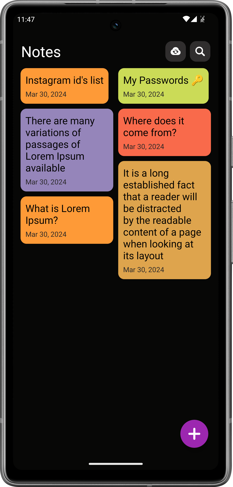
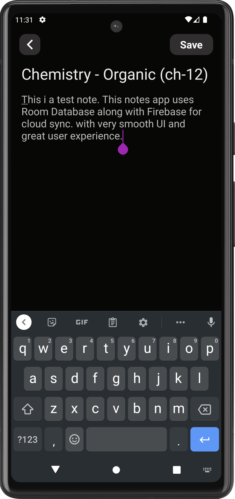

# Notes App (Android)

Welcome to my NoteSync App project! This Android application is designed to help users save and synchronize notes across devices. It's part of my portfolio to showcase my skills in mobile app development using Java.

## Overview

Note App is a simple yet powerful note-taking application that allows users to create, edit, and sync notes across multiple devices. Whether you're jotting down quick thoughts, making a to-do list, or drafting important ideas, NoteSync has got you covered. With seamless integration between local and cloud storage, your notes are always accessible and up-to-date.

<h2 align="left">

Screenshots
</h2>

## Features

- **Local and Cloud Sync**: Seamlessly synchronize notes across devices using local storage and cloud services.
- **Create and Edit Notes**: Easily create new notes or edit existing ones with a simple and intuitive interface.
- **Offline Access**: Access your notes even when you're offline, with automatic syncing once you're back online.
- **Secure Storage**: Your notes are securely stored both locally and in the cloud, ensuring data integrity and privacy.

## Technologies Used

- **Language**: Java
- **Development Platform**: Android Studio
- **Local Storage**: SQLite Database
- **Cloud Storage**: Firebase Storage
- **Search Algorithm**: Trie

## Installation

The Notes App is currently available for Android devices only. To install the app, follow these steps:

1. [Download Apk](https://manish99verma.github.io/my-portfolio/assets/apks/notes-app.apk)
2. Enable installation from unknown sources in your device settings.
3. Install the APK file on your Android device.
4. Open the app and start taking notes, knowing they're securely synced across all your devices!

## Contact

For any inquiries or feedback, feel free to reach out to me at manish6203993@gmail.com
